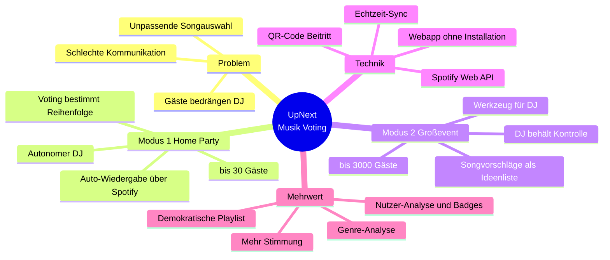

# 🎵 UpNext — Musik Voting
### Schritt 0 · Projektbegründung & Projektidee

|  |  |
|---|---|
| **Projekt** | UpNext – Musik Voting |
| **Dokument** | Projektbegründung & Projektidee |
| **Version** | 1.0 |
| **Datum** | 28.04.2026 |
| **Autoren** | Christian Hahnl · Andreas Klehr |
| **Status** | Freigegeben |

---

## 1. Brainstorming

Ausgangsfrage: *Wie kann die Musikauswahl auf Partys und Events fairer und interaktiver werden,
ohne dass alle den DJ bedrängen müssen?*

Gesammelte Ideen aus dem Team:

- 💡 Gäste schlagen Songs über das eigene Handy vor – **ohne App-Installation**
- 💡 Abstimmung („Voting") entscheidet über die Reihenfolge der Songs
- 💡 Schlecht bewertete Songs verschwinden automatisch aus der Warteschlange
- 💡 Beitritt zur Party in Sekunden über einen **QR-Code**
- 💡 Zwei Welten: die kleine **Home-Party** vs. das große **Club-Event**
- 💡 Anbindung an einen echten Streaming-Dienst statt eigener Musikbibliothek → **Spotify**
- 💡 Spielerische Elemente: Badges/Ränge für aktive Gäste
- 💡 Genre-Auswertung: „Was will die Crowd gerade hören?"

## 2. Mindmap

## 3. Projektbegründung

#### Warum gibt es dieses Projekt?

Auf Partys und Events entsteht regelmäßig **Unzufriedenheit mit der Musikauswahl**. Lokale DJs
(z. B. Patrick Biggs, Bruce) treffen nicht den Geschmack der Gäste, und es fehlt ein einfacher,
geordneter Weg, Musikwünsche zu äußern. Gäste drängen sich um das DJ-Pult oder geben auf – beides
schadet der Stimmung.

#### Welches Problem wird gelöst?

| Problem heute | Lösung mit UpNext |
|---------------|-------------------|
| Gäste haben keinen Einfluss auf die Musik | Jeder kann Songs vorschlagen und abstimmen |
| Wünsche werden lautstark/chaotisch geäußert | Geordnetes, digitales Voting über das Handy |
| DJ kennt die Stimmung der Crowd nicht | Live-Übersicht beliebter Songs/Genres |
| Hürde durch App-Installation | Reine Webanwendung, Beitritt per QR-Code |
| Unpassende Songs blockieren die Playlist | Schlecht bewertete Songs werden verdrängt |

#### Warum lohnt sich der Aufwand?

- Klar abgegrenzter Funktionsumfang, der in der verfügbaren Projektzeit umsetzbar ist
- Nutzung einer bestehenden Plattform (Spotify) statt Aufbau einer eigenen Musikbibliothek
- Skalierbares Konzept: vom Wohnzimmer (Modus 1) bis zum Club mit 3.000 Gästen (Modus 2)
- Hoher Lerneffekt: moderne Webtechnologien (Angular, Realtime-Datenbank, OAuth, externe API)

#### Abgrenzung (Was wird NICHT gebaut?)

- Keine eigene Musikplattform / kein eigener Streaming-Dienst
- Keine native App für App Store / Play Store
- Kein eigenes Bezahlsystem (Spotify-Premium-Abos sind vorausgesetzt)

---

*UpNext — Musik Voting · Projektbegründung · Version 1.0 · 28.04.2026*

