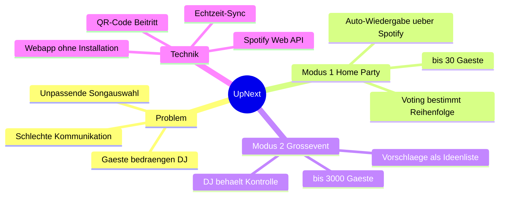

# Projektbegründung & Projektidee

Projekt: UpNext - Musik Voting
Projektteam: Christian Hahnl, Andreas Klehr
Stand: 28.04.2026

## Brainstorming

Ausgangsfrage: Wie kann die Musikauswahl auf Partys und Events fairer und interaktiver werden,
ohne dass alle den DJ bedrängen müssen?

Ideen aus dem Team:

- Gäste schlagen Songs über das eigene Handy vor, ohne App-Installation
- Eine Abstimmung entscheidet über die Reihenfolge der Songs
- Schlecht bewertete Songs verschwinden aus der Warteschlange
- Beitritt zur Party über einen QR-Code
- Zwei Varianten: kleine Home-Party und großes Club-Event
- Anbindung an Spotify statt einer eigenen Musikbibliothek
- Badges/Ränge für aktive Gäste
- Auswertung, welche Genres gerade gut ankommen

## Mindmap

## Projektbegründung

Auf Partys und Events entscheidet meistens eine einzelne Person über die Musik. Die Gäste haben
kaum eine geordnete Möglichkeit, ihre Wünsche einzubringen. Daraus entsteht Unzufriedenheit, die
Gäste drängen sich um das DJ-Pult, und die Musik trifft oft nicht die Stimmung.

Auslöser für das Projekt waren wiederkehrende Beschwerden über lokale DJs und die schlechte
Kommunikation zwischen Gästen und DJ.

Gegenüberstellung:

| Problem heute | Lösung mit UpNext |
|---------------|-------------------|
| Gäste haben keinen Einfluss auf die Musik | Jeder kann Songs vorschlagen und abstimmen |
| Wünsche werden chaotisch zugerufen | Geordnetes Voting über das Handy |
| DJ kennt die Stimmung der Crowd nicht | Übersicht über beliebte Songs |
| Hürde durch App-Installation | Reine Webanwendung, Beitritt per QR-Code |
| Unpassende Songs blockieren die Playlist | Schlecht bewertete Songs werden verdrängt |

Warum sich das Projekt lohnt:

- Klar abgegrenzter Umfang, der in der Projektzeit umsetzbar ist
- Nutzung von Spotify statt Aufbau einer eigenen Musikbibliothek
- Vom Wohnzimmer bis zum Club skalierbar
- Lerneffekt mit Angular, einer Echtzeit-Datenbank, OAuth und einer externen API

## Abgrenzung (Nicht-Ziele)

- Keine eigene Musikplattform und kein eigener Streaming-Dienst
- Keine native App für App Store oder Play Store
- Kein eigenes Bezahlsystem, Spotify-Premium wird vorausgesetzt
