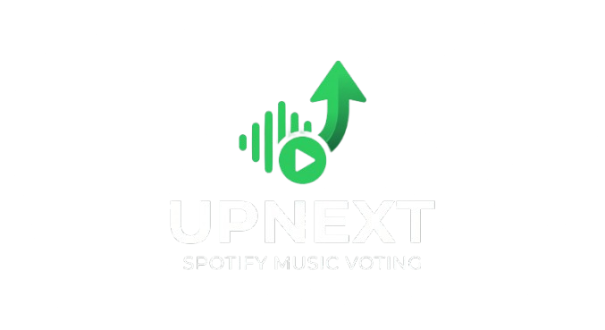

<style>
@import url('https://fonts.googleapis.com/css2?family=Inter:wght@400;500;600;700;800;900&family=Space+Grotesk:wght@500;600;700&display=swap');
:root{
  --bg:#070707;--card:#151515;--card2:#1e1e1e;--text:#fff;--muted:#a7a7ad;--faint:#6e6e74;
  --border:#262626;--green:#1ed760;--green2:#1db954;--violet:#b721ff;--danger:#f0334b;
}
body{background:var(--bg);color:var(--text);font-family:'Inter',system-ui,-apple-system,'Segoe UI',sans-serif;
  line-height:1.65;max-width:980px;margin:0 auto;padding:0 24px 96px;letter-spacing:-.011em;}
h1,h2,h3,h4{font-family:'Space Grotesk','Inter',sans-serif;letter-spacing:-.02em;color:#fff;}
h2{margin-top:2.4em;padding-bottom:.35em;border-bottom:1px solid var(--border);font-size:1.5rem;}
h2::before{content:'';display:inline-block;width:10px;height:10px;border-radius:3px;
  background:linear-gradient(180deg,#28e974,var(--green));margin-right:12px;vertical-align:middle;}
h3{color:var(--green);font-size:1.12rem;margin-top:1.8em;}
a{color:var(--green);text-decoration:none;}
a:hover{text-decoration:underline;}
strong{color:#fff;}
table{border-collapse:collapse;width:100%;margin:1.2em 0;font-size:.93rem;
  background:var(--card);border:1px solid var(--border);border-radius:12px;overflow:hidden;}
th{background:#101010;color:var(--muted);text-transform:uppercase;font-size:.72rem;
  letter-spacing:.08em;text-align:left;padding:12px 14px;border-bottom:1px solid var(--border);}
td{padding:11px 14px;border-bottom:1px solid var(--border);color:#d8d8db;vertical-align:top;}
tr:last-child td{border-bottom:none;}
tr:hover td{background:rgba(255,255,255,.025);}
code{background:#0d0d0d;border:1px solid var(--border);border-radius:6px;padding:.12em .45em;
  font-size:.88em;color:var(--green);}
blockquote{border-left:3px solid var(--green);background:rgba(30,215,96,.06);margin:1.2em 0;
  padding:.6em 1.1em;border-radius:0 10px 10px 0;color:var(--muted);}
hr{border:none;border-top:1px solid var(--border);margin:2.4em 0;}
ul li::marker{color:var(--green);}
.hero{display:flex;align-items:center;gap:18px;margin:40px 0 8px;}
.hero img{width:64px;height:64px;filter:drop-shadow(0 6px 18px rgba(30,215,96,.4));}
.hero .t{margin:0;font-size:2.6rem;font-weight:700;font-family:'Space Grotesk';
  background:linear-gradient(180deg,#fff 30%,#c7cad6);-webkit-background-clip:text;
  background-clip:text;-webkit-text-fill-color:transparent;line-height:1;}
.hero .s{margin:6px 0 0;font-size:.72rem;font-weight:600;letter-spacing:.28em;
  text-transform:uppercase;color:var(--faint);}
.pills{display:flex;flex-wrap:wrap;gap:8px;margin:14px 0 6px;}
.pill{display:inline-block;background:var(--card);border:1px solid var(--border);
  border-radius:999px;padding:6px 14px;font-size:.74rem;font-weight:600;color:var(--muted);}
.pill.green{background:rgba(30,215,96,.12);border-color:rgba(30,215,96,.3);color:var(--green);}
.pill.violet{background:rgba(183,33,255,.12);border-color:rgba(183,33,255,.3);color:#d98bff;}
</style>

<div class="hero">
  
  <div>
    <p class="t">upNext</p>
    <p class="s">Gemeinsam Musik hören</p>
  </div>
</div>

<div class="pills">
  <span class="pill green">Dokument 00</span>
  <span class="pill">Projektbegründung</span>
  <span class="pill violet">Schritt 0 · Idee</span>
</div>

# Projektbegründung & Projektidee

## Brainstorming

Ausgangspunkt war eine wiederkehrende Beobachtung auf Partys und Events: Die Musik passt
oft nicht zur Stimmung der Gäste, und niemand traut sich, den DJ anzusprechen. Im Team
haben wir gesammelt, woran das liegt und wie man es lösen könnte.

| Problem | Beobachtung | Lösungsidee |
|---------|-------------|-------------|
| Einseitige Musik | DJ spielt nur seinen Geschmack | Gäste stimmen über Songs ab |
| Hemmschwelle | Niemand geht zum DJ ans Pult | Songwünsche digital, anonym |
| Kein Überblick | DJ weiß nicht, was ankommt | Live-Stimmungsbild der Wünsche |
| Heimpartys ohne DJ | Handy wird ständig weitergereicht | „autonomer DJ" steuert die Queue |
| Manipulation | Einzelne pushen ihre Songs | Voting demokratisiert die Reihenfolge |

## Mindmap

```text
                         ┌─────────────────────────┐
                         │        UpNext           │
                         │  Gemeinsam Musik hören  │
                         └────────────┬────────────┘
            ┌─────────────────────────┼─────────────────────────┐
            │                         │                          │
     ┌──────┴───────┐          ┌──────┴───────┐          ┌───────┴──────┐
     │  Modus 1     │          │   Modus 2    │          │  Gemeinsam   │
     │ Private Party│          │    Event     │          │              │
     ├──────────────┤          ├──────────────┤          ├──────────────┤
     │ QR-Beitritt  │          │ Songwünsche  │          │ Responsive   │
     │ Song-Voting  │          │ an den DJ    │          │ Web-App      │
     │ Auto-Play    │          │ DJ behält    │          │ Keine        │
     │ (Spotify)    │          │ Kontrolle    │          │ Installation │
     │ Auto-Remove  │          │ Stimmungs-   │          │ Spotify-     │
     │ bei Downvotes│          │ bild         │          │ Login (Host) │
     └──────────────┘          └──────────────┘          └──────────────┘
```

## Projektbegründung

#### Warum gibt es dieses Projekt?

- **Zunehmende Unzufriedenheit** mit lokalen DJs und unpassender Songauswahl.
- **Kommunikationslücke** zwischen Gästen und DJ – Wünsche erreichen ihn nicht.
- **Wunsch nach Interaktion**: Gäste wollen die Musik aktiv mitgestalten, statt nur zu konsumieren.
- **Marktlücke**: Es fehlt eine leichtgewichtige Lösung, die *ohne App-Installation* funktioniert
  und sich an die vorhandene Spotify-Infrastruktur anlehnt.

#### Warum lohnt sich der Aufwand?

- Spotify-Konten und Premium-Abos sind im Zielpublikum bereits weit verbreitet.
- Der Einstieg per QR-Code ist nahezu reibungslos – ein Scan genügt.
- Das Voting-Prinzip ist einfach verständlich und sofort einsetzbar.

#### Abgrenzung der Idee

- UpNext ist **keine eigene Musikplattform** – Wiedergabe und Katalog kommen von Spotify.
- UpNext **ersetzt den DJ nicht** (Modus 2), sondern unterstützt ihn.

> **Fazit:** Eine kleine, fokussierte Web-App löst ein reales, alltägliches Problem auf
> Partys und Events – mit überschaubarem technischem Aufwand und klarem Mehrwert für
> Gäste *und* Gastgeber.
