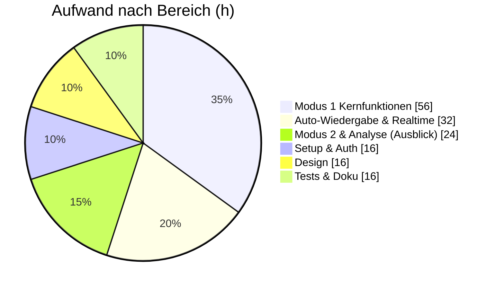

# 🎵 UpNext — Musik Voting
### Schritt 2 · Aufwandsschätzung

|  |  |
|---|---|
| **Projekt** | UpNext – Musik Voting |
| **Dokument** | Aufwandsschätzung |
| **Verfahren** | T-Shirt-Size-Methode |
| **Version** | 1.0 |
| **Datum** | 30.04.2026 |
| **Autoren** | Christian Hahnl · Andreas Klehr |
| **Status** | Freigegeben |

---

## 1. Methode

Die Schätzung erfolgt mit der **T-Shirt-Size-Methode**. Jede Anforderung erhält eine Größe statt
einer exakten Stundenzahl. Als bekannte Referenz (Anker) dient **FA01 – Spotify-Login (PKCE) = M**.
Davon ausgehend wurden alle weiteren Aufwände im Team eingeschätzt.

#### Größen & Stunden-Richtwerte

> Die Richtwerte wurden einmalig zu Projektbeginn festgelegt und werden nicht mehr verändert.

| Größe | Bedeutung | Richtwert (h) |
|-------|-----------|:-------------:|
| **XS** | Triviale Aufgabe, kein nennenswertes Risiko | 2 |
| **S**  | Überschaubar, bekannte Lösung | 4 |
| **M**  | Normaler Arbeitsaufwand, wenig Unbekanntes | 8 |
| **L**  | Komplex, unbekannt oder viel Abstimmung nötig | 16 |
| **XL** | Sehr groß – **muss aufgeteilt werden** | 32 |

## 2. Vorgehen

1. Alle Anforderungen aus dem Projektauftrag auflisten
2. Im Team jede Anforderung mit einer Größe versehen (Diskussion bei Abweichungen)
3. Stunden je Größe aufaddieren → Gesamtaufwand
4. Mit verfügbarer Kapazität vergleichen, Scope ggf. anpassen

## 3. Ergebnis der Schätzung

### 3.1 Funktionale Anforderungen

| ID | Anforderung | Größe | Aufwand (h) |
|------|-------------|:-----:|:-----------:|
| FA01 | Spotify-Login (OAuth 2.0 / PKCE) | M | 8 |
| FA02 | Session erstellen + QR-Code-Generierung | M | 8 |
| FA03 | Session beitreten (Session-ID / QR + Namenseingabe) | S | 4 |
| FA04 | Songsuche über Spotify | M | 8 |
| FA05 | Song zur Warteschlange hinzufügen | M | 8 |
| FA06 | Voting (Up-/Downvote) | M | 8 |
| FA07 | Queue-Sortierung nach Score | S | 4 |
| FA08 | Automatisches Entfernen gespielter Songs | M | 8 |
| FA09 | Automatische Wiedergabe + Geräteauswahl | L | 16 |
| FA10 | Teilnehmerverwaltung (Sperren/Entsperren) | S | 4 |
| FA11 | Session beenden | S | 4 |
| FA12 | Echtzeit-Synchronisation (Realtime) | L | 16 |
| FA13 | Modus 2 – Ideenliste für DJ *(Ausblick)* | M | 8 |
| FA14 | Nutzer-/Genre-Analyse & Badges *(Ausblick)* | L | 16 |
| | **Zwischensumme funktional** | | **120** |

### 3.2 Nicht-funktionale & übergreifende Anforderungen

| ID | Anforderung | Größe | Aufwand (h) |
|------|-------------|:-----:|:-----------:|
| INF01 | Projektsetup (Angular, Supabase, DB-Schema) | M | 8 |
| NF01 | Responsives Design / Styling (Mobile-first) | L | 16 |
| NF02 | Tests (Vitest) & Testprotokoll | M | 8 |
| DOK01 | Projektmanagement-Dokumentation | M | 8 |
| | **Zwischensumme übergreifend** | | **40** |

### 3.3 Verteilung nach Größe

| Größe | Anzahl | h je Stück | Summe (h) |
|-------|:------:|:----------:|:---------:|
| XS | 0 | 2 | 0 |
| S  | 4 | 4 | 16 |
| M  | 9 | 8 | 72 |
| L  | 4 | 16 | 64 |
| XL | 0 | 32 | 0 |
| | | **Gesamt** | **152** |

> Hinweis: Es wurde bewusst keine XL-Anforderung in den Plan übernommen – große Brocken
> (Realtime-Sync, Auto-Wiedergabe) wurden in L-Pakete heruntergebrochen.

## 4. Gesamtaufwand & Kapazitätsabgleich

| | |
|---|---:|
| **Geschätzter Gesamtaufwand** | **≈ 152 h** |
| Verfügbare Kapazität (2 Personen × 7 Wochen × ≈ 14 h) | ≈ 196 h |
| Puffer für Testing & Bugfixing | ≈ 44 h |

> ✅ **Ergebnis:** Der Scope passt. Bei ca. 196 h Kapazität und 152 h geschätztem Aufwand
> bleibt ein Puffer von rund 44 h für Tests, Bugfixing und Unvorhergesehenes. Die Ausblick-Features
> (FA13, FA14) sind als „Nice-to-have" eingeplant und werden bei Zeitknappheit nach hinten gereiht.

---

*UpNext — Musik Voting · Aufwandsschätzung · Version 1.0 · 30.04.2026*

