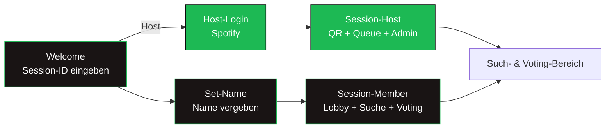
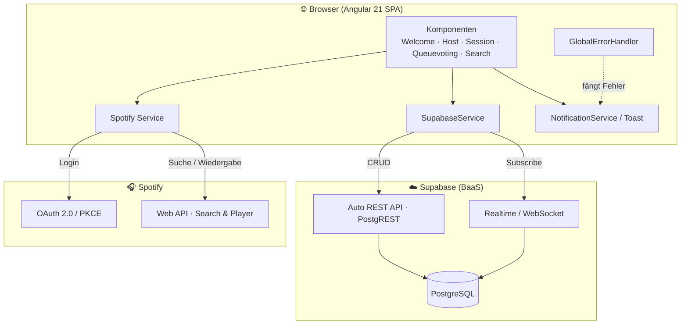
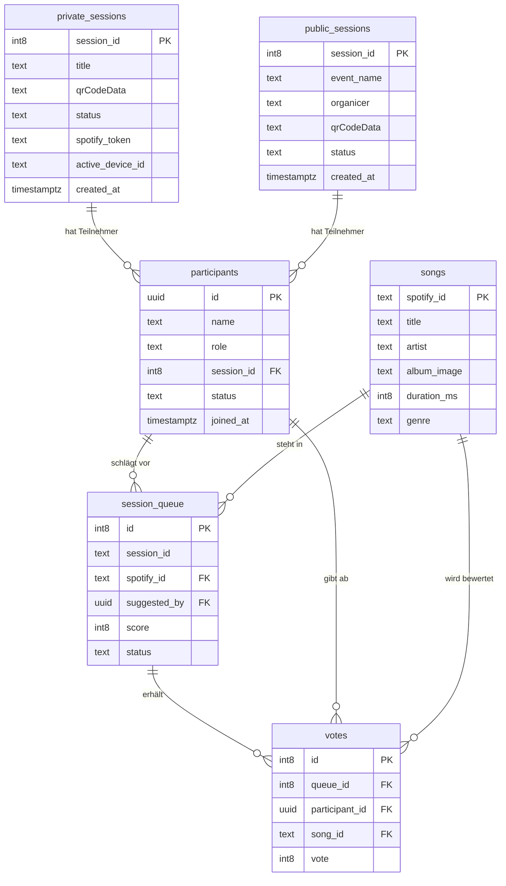

<div align="center">

# 🎵 UpNext — Musik Voting
### Schritt 3 · Pflichtenheft

</div>

|  |  |
|---|---|
| **Projekt** | UpNext – Musik Voting |
| **Dokument** | Pflichtenheft |
| **Version** | 1.0 |
| **Datum** | 05.05.2026 |
| **Autoren** | Christian Hahnl · Andreas Klehr |
| **Status** | Freigegeben (Meilenstein M1) |

---

## Inhaltsverzeichnis

1. [Ausgangslage](#1-ausgangslage)
2. [Ist-Zustand](#2-ist-zustand)
3. [Zielsetzung](#3-zielsetzung)
4. [Anforderungen](#4-anforderungen)
5. [UI-Konzept](#5-ui-konzept)
6. [Lieferobjekte](#6-lieferobjekte)
7. [Technische Dokumentation](#7-technische-dokumentation)
   - [7.1 Architektur](#71-architektur)
   - [7.2 Datenkatalog](#72-datenkatalog)
   - [7.3 ERD](#73-erd)
   - [7.4 API-Dokumentation](#74-api-dokumentation)
   - [7.5 Setup](#75-setup)
   - [7.6 Testkonzept](#76-testkonzept)

---

## 1. Ausgangslage

Auf Partys und Events entscheidet meist eine einzelne Person (Host oder DJ) über die Musik.
Gäste haben kaum geordnete Möglichkeiten, ihre Wünsche einzubringen. Das führt zu Unzufriedenheit,
zu lautstarkem Bedrängen des DJs und zu einer Musikauswahl, die nicht die Stimmung der Crowd trifft.
Es fehlt ein einfaches, digitales Werkzeug, mit dem **alle Gäste demokratisch Einfluss** auf die
Playlist nehmen können – ohne technische Hürden wie App-Installationen.

## 2. Ist-Zustand

| Bestehende Lösung | Schwäche |
|-------------------|----------|
| **Zuruf an den DJ** | chaotisch, unfair, unterbricht den DJ, skaliert nicht |
| **Klassische Spotify-Playlist** | nur eine Person verwaltet sie, keine Mitbestimmung |
| **Spotify „Jam" / Gruppen-Sessions** | keine Abstimmung, keine Verdrängung schlechter Songs, an Spotify-Accounts aller Gäste gebunden |
| **Wunschzettel / Zettelwirtschaft** | analog, nicht in Echtzeit, kein Ranking |

Kurz: Es existiert **kein System, das Songvorschläge mit einem Abstimmungsmechanismus
kombiniert** und gleichzeitig ohne App-Installation für viele Gäste nutzbar ist.

## 3. Zielsetzung

#### Soll-Zustand

Eine responsive **Webanwendung**, die zwei Betriebsmodi bereitstellt:

- **Modus 1 (Home Party, bis 30 Gäste):** Vollautomatisierte, demokratische Steuerung der Playlist.
  Gäste schlagen Songs vor und stimmen ab; die Warteschlange sortiert sich nach Score und spielt
  automatisch über das Spotify-Gerät des Hosts.
- **Modus 2 (Großevents/Clubs, bis 3.000 Gäste):** Werkzeug für den DJ. Gäste schlagen Songs vor
  und bewerten sie; der DJ sieht die Wünsche, behält aber die volle Kontrolle über die Wiedergabe.

#### Ziele (messbar)

- Beitritt zu einer Session über einen vom Host generierten **QR-Code**
- **Keine App-Installation** notwendig (reine Webanwendung)
- Songvorschläge werden in **unter 3 Sekunden** verarbeitet
- Abstimmungsergebnisse werden **korrekt und in Echtzeit** aktualisiert
- In Modus 2 sind technisch **bis zu 3.000 gleichzeitige Nutzer** je Session vorgesehen
- Fehlerfreier Betrieb während eines Testevents in Modus 1

#### Nicht-Ziele (Abgrenzung)

- Keine eigene Musikplattform / kein eigener Streaming-Dienst
- Keine native Mobile-App (App Store / Play Store)
- Kein eigenes Benutzerkonto-System mit Passwörtern (Identifikation über Session + Name)
- Kein Bezahlsystem (Spotify-Premium wird vorausgesetzt)

## 4. Anforderungen

#### 4.1 Funktionale Anforderungen

Priorität: **M** = Muss · **S** = Soll · **K** = Kann

| ID | Anforderung | Beschreibung | Prio | Modus |
|------|-------------|--------------|:----:|:-----:|
| FA01 | Spotify-Login | Host meldet sich per OAuth 2.0 (PKCE) mit Spotify-Premium an | M | 1 |
| FA02 | Session erstellen | Host legt Session mit Titel an; System erzeugt Session-ID + QR-Code | M | 1 |
| FA03 | Session beitreten | Gast tritt per QR-Code/Session-ID bei und vergibt einen Namen | M | 1+2 |
| FA04 | Songsuche | Gast sucht Songs über die Spotify-Datenbank | M | 1+2 |
| FA05 | Song hinzufügen | Gast fügt einen Song zur Warteschlange/Ideenliste hinzu | M | 1+2 |
| FA06 | Voting | Teilnehmer geben Up-/Downvotes auf Songs ab (1 Stimme pro Person/Song) | M | 1+2 |
| FA07 | Queue-Ranking | Warteschlange wird absteigend nach Score sortiert (Top 10) | M | 1 |
| FA08 | Gespielte Songs entfernen | Der aktuell laufende Song wird automatisch aus der Queue entfernt | M | 1 |
| FA09 | Auto-Wiedergabe | Songs werden automatisch auf dem gewählten Spotify-Gerät des Hosts abgespielt | M | 1 |
| FA10 | Teilnehmerverwaltung | Host kann Teilnehmer sperren/entsperren (Realtime-Rauswurf) | S | 1 |
| FA11 | Session beenden | Host beendet die Session; alle Teilnehmer werden automatisch entfernt | M | 1 |
| FA12 | Echtzeit-Sync | Queue, Votes und Lobby werden live für alle synchronisiert | M | 1 |
| FA13 | Downvote-Verdrängung | Stark negativ bewertete Songs sinken ans Ende / werden verdrängt | K | 1 |
| FA14 | Ideenliste DJ | DJ sieht bewertete Vorschläge ohne automatische Wiedergabe | K | 2 |
| FA15 | Nutzer-/Genre-Analyse | Auswertung von Abstimmungsverhalten, Badges, beliebte Genres | K | 1+2 |
| FA16 | Fehlerbenachrichtigung | Benutzerfreundliche Fehlermeldungen über Toast-Komponente | M | 1+2 |

#### 4.2 Nicht-funktionale Anforderungen

| ID | Anforderung | Messbares Kriterium |
|------|-------------|---------------------|
| NF01 | Responsiv / Mobile-first | Bedienbar auf Smartphone-Bildschirmen ohne horizontales Scrollen |
| NF02 | Performance | Songvorschlag in < 3 s verarbeitet |
| NF03 | Skalierbarkeit | Architektur für bis zu 3.000 gleichzeitige Nutzer je Session (Modus 2) |
| NF04 | Keine Installation | Lauffähig im modernen Browser ohne Plugin/App |
| NF05 | Zugriffsschutz | Host-only-Funktionen sind serverseitig/abgesichert (kein Broken Access Control) |
| NF06 | Stabilität | Fehlerfreier Betrieb während eines Testevents |
| NF07 | Wartbarkeit | Komponentenbasierte Architektur, getrennte Service-Schicht |

## 5. UI-Konzept

Die Anwendung ist **Mobile-first** gestaltet. Zentrale Seiten:



#### Wichtigste Screens (Wireframe-Beschreibung)

| Screen | Inhalt |
|--------|--------|
| **Welcome** | Eingabefeld für Session-ID, Button „Session erstellen" (Host) |
| **Set-Name** | Namenseingabe vor dem Beitritt zur Session |
| **Host-Login** | „Mit Spotify anmelden", danach Session-Titel + „Session starten" |
| **Session-Host** | QR-Code (Beitritt), Geräteauswahl, Teilnehmerliste mit Sperren-Button, „Now Playing" + Queue, „Session beenden" |
| **Session-Member** | Lobby (Host + Mitglieder), Songsuche, Warteschlange mit Up-/Downvote-Buttons |
| **Now Playing / Queue** | Aktueller Song mit Cover, darunter Top-10-Warteschlange mit Score & Restdauer |
| **Error (404)** | Fehlerseite bei ungültiger Session / fehlender Berechtigung |

> Design-Sprache angelehnt an Spotify: dunkler Hintergrund (`#191414`), Akzentfarbe Grün
> (`#1db954`), abgerundete Karten, große Touch-Targets für mobile Bedienung.

## 6. Lieferobjekte

| Lieferobjekt | Inhalt | Abnahmekriterium |
|--------------|--------|------------------|
| **Webanwendung (Prototyp)** | Lauffähige Angular-App, Modus 1 | FA01–FA09, FA11, FA12 bestanden (siehe Testprotokoll) |
| **Datenbank (Supabase)** | Schema, Tabellen, Realtime aktiviert | Alle Tabellen aus dem Datenkatalog vorhanden, Realtime auf `session_queue` aktiv |
| **Projektdokumentation** | Auftrag, Pflichtenheft, Arbeitspakete, Gantt, Testprotokoll | Alle Kapitel vollständig, Checkliste abgehakt |
| **README** | Start-/Installationsanleitung | App startet auf fremdem Rechner laut Anleitung |
| **Präsentation** | Pitch inkl. Live-Demo | Demo läuft live in Modus 1 |

---

## 7. Technische Dokumentation

### 7.1 Architektur

UpNext ist eine **Single-Page-Application (SPA)** auf Basis von Angular. Es gibt **kein eigenes
Backend** – die Persistenz und Echtzeit-Kommunikation übernimmt **Supabase** (Backend-as-a-Service,
PostgreSQL + Realtime + Auto-generierte REST-API). Die Musikdaten und die Wiedergabe kommen über
die **Spotify Web API**.



#### Technologie-Stack

| Schicht | Technologie |
|---------|-------------|
| Frontend | Angular 21 (Standalone Components, Signals), TypeScript 5.9, SCSS |
| Datenbank / Backend | Supabase (PostgreSQL 14.5, Realtime, PostgREST) |
| Musik / Auth | Spotify Web API (`@spotify/web-api-ts-sdk`), OAuth 2.0 mit PKCE |
| QR-Codes | `angularx-qrcode` |
| State / Reactivity | Angular Signals, RxJS |
| Tests | Vitest |

#### Wichtige Architektur-Entscheidungen

- **Realtime statt Polling für die DB:** Queue-Änderungen werden über Supabase-Realtime
  (`postgres_changes` auf `session_queue`) an alle Clients gepusht.
- **Spotify-Polling:** Da Spotify keine Webhooks für den Wiedergabestatus bietet, pollt der
  Host-Client den aktuell laufenden Song alle 4 Sekunden und entfernt gespielte Songs.
- **Token-Sharing:** Der Host teilt sein Spotify-Token über die Session, damit Mitglieder ohne
  eigenen Spotify-Account suchen können.
- **Session-ID-Konvention:** Die erste Ziffer kodiert den Modus (`1xxxxx` = privat/Modus 1,
  `2xxxxx` = öffentlich/Modus 2).

### 7.2 Datenkatalog

Datenbank: **PostgreSQL** (Supabase), Schema `public`.

#### Tabelle `private_sessions` — Modus-1-Sessions

| Spalte | Typ | Beschreibung |
|--------|-----|--------------|
| `session_id` | `int8` (PK) | Eindeutige Session-ID (`1xxxxx`) |
| `title` | `text` | Anzeigename der Session |
| `qrCodeData` | `text` | Beitritts-URL für den QR-Code |
| `status` | `text` | `running` / `finished` |
| `spotify_token` | `text` | Geteiltes Spotify-Token (JSON) |
| `active_device_id` | `text` | Aktives Spotify-Wiedergabegerät |
| `duration_ms` | `int8` | (optional) Dauer-Information |
| `created_at` | `timestamptz` | Erstellungszeitpunkt |

#### Tabelle `public_sessions` — Modus-2-Sessions

| Spalte | Typ | Beschreibung |
|--------|-----|--------------|
| `session_id` | `int8` (PK) | Eindeutige Session-ID (`2xxxxx`) |
| `event_name` | `text` | Name des Events |
| `organicer` | `text` | Veranstalter (DJ) |
| `qrCodeData` | `text` | Beitritts-URL für den QR-Code |
| `status` | `text` | Status der Session |
| `created_at` | `timestamptz` | Erstellungszeitpunkt |

#### Tabelle `participants` — Teilnehmer einer Session

| Spalte | Typ | Beschreibung |
|--------|-----|--------------|
| `id` | `uuid` (PK) | Eindeutige Teilnehmer-ID (im Browser gespeichert) |
| `name` | `text` | Anzeigename |
| `role` | `text` | `host` / `member` |
| `session_id` | `int8` (FK) | Zugehörige Session |
| `status` | `text` | `active` / `blocked` |
| `joined_at` | `timestamptz` | Beitrittszeitpunkt |

#### Tabelle `songs` — globaler Song-Katalog

| Spalte | Typ | Beschreibung |
|--------|-----|--------------|
| `spotify_id` | `text` (PK) | Spotify-Track-URI (`spotify:track:…`) |
| `title` | `text` | Songtitel |
| `artist` | `text` | Künstler |
| `album_image` | `text` | Cover-URL |
| `duration_ms` | `int8` | Songlänge in Millisekunden |
| `genre` | `text` | Genre (für Analyse) |
| `sessionId` | `int8` | Session, in der der Song zuerst auftauchte |

#### Tabelle `session_queue` — Warteschlange je Session

| Spalte | Typ | Beschreibung |
|--------|-----|--------------|
| `id` | `int8` (PK) | Eindeutiger Queue-Eintrag |
| `session_id` | `text` | Session-Referenz (UUID-formatiert) |
| `spotify_id` | `text` (FK → `songs`) | Referenzierter Song |
| `suggested_by` | `uuid` (FK → `participants`) | Vorschlagender Teilnehmer |
| `score` | `int8` | Aktuelle Punktzahl (Summe der Votes) |
| `status` | `text` | `queued` / gespielt |

#### Tabelle `votes` — abgegebene Stimmen

| Spalte | Typ | Beschreibung |
|--------|-----|--------------|
| `id` | `int8` (PK) | Eindeutige Stimme |
| `queue_id` | `int8` (FK → `session_queue`) | Bewerteter Queue-Eintrag |
| `participant_id` | `uuid` (FK → `participants`) | Wählender Teilnehmer |
| `song_id` | `text` (FK → `songs`) | Bewerteter Song |
| `vote` | `int8` | `+1` (Upvote) / `-1` (Downvote) |

### 7.3 ERD



### 7.4 API-Dokumentation

UpNext nutzt zwei externe Schnittstellen. Da kein eigenes Backend existiert, ist die „interne API"
die Service-Schicht (`SupabaseService`) über der von Supabase **automatisch generierten REST-API
(PostgREST)**.

#### 7.4.1 Datenzugriff — `SupabaseService` (über PostgREST)

| Operation (Methode) | Tabelle / Aktion | Request | Response | Auth |
|---------------------|------------------|---------|----------|------|
| `addPrivateSession(title)` | `INSERT private_sessions` | `title`, generierte `session_id`, `qrCodeData`, `status='running'` | erzeugte Session-Zeile | anon key |
| `joinPrivateSession(id)` | `SELECT private_sessions` | `session_id` | Session oder `null` | anon key |
| `getPrivateSessionInfos(id)` | `SELECT private_sessions` | `session_id` | vollständige Session | anon key |
| `addUser(name, sessionId, host)` | `INSERT participants` | `name`, `role`, `session_id` | `{ id }` | anon key |
| `getAllParticipantsBySessionId(id)` | `SELECT participants` | `session_id` | Teilnehmerliste (sortiert) | anon key |
| `checkHost(userId, sessionId)` | `SELECT participants` | `id`, `session_id`, `role='host'` | Treffer oder `null` (Zugriffsschutz) | anon key |
| `setParticipantStatus(id, status)` | `UPDATE participants` | `status` (`active`/`blocked`) | – | anon key |
| `endSession(sessionId)` | `UPDATE private_sessions` | `status='finished'` | – | anon key |
| `addSongToQueue(sessionId, song, userId)` | `UPSERT songs` + `INSERT session_queue` | Song-Metadaten, `suggested_by`, `score=1` | Queue-Eintrag | anon key |
| `getQueue(sessionId)` | `SELECT session_queue + songs` | `session_id`, `status='queued'`, Top 10 nach Score | Queue mit Song-Daten | anon key |
| `removeSongFromQueue(queueId)` | `DELETE votes` + `DELETE session_queue` | `queue_id` | – | anon key |
| `vote(queueId, participantId, value)` | `UPSERT votes` + Score-Update | `queue_id`, `participant_id`, `vote=±1` | aktualisierter Eintrag | anon key |
| `subscribeToQueue(sessionId, cb)` | Realtime `postgres_changes` | Channel-Abo auf `session_queue` | Push bei jeder Änderung | anon key |

#### 7.4.2 Genutzte Spotify-Web-API-Endpunkte

| Zweck | Methode · Endpunkt | Auth |
|-------|--------------------|------|
| Login / Autorisierung | `GET /authorize` (OAuth 2.0 PKCE) | Client-ID + PKCE |
| Aktuelles Profil | `GET /v1/me` | Bearer-Token |
| Songsuche | `GET /v1/search?type=track&market=AT` | Bearer-Token |
| Verfügbare Geräte | `GET /v1/me/player/devices` | Bearer-Token |
| Wiedergabe übertragen | `PUT /v1/me/player` | Bearer-Token |
| Aktuell gespielt | `GET /v1/me/player/currently-playing` | Bearer-Token |
| Zur Spotify-Queue hinzufügen | `POST /v1/me/player/queue?uri=…` | Bearer-Token |

> **Hinweis zum Zugriffsschutz (NF05):** Host-exklusive Aktionen prüfen über `checkHost()`, ob die
> im Browser gespeicherte `userId` in der Session die Rolle `host` hat. Ist das nicht der Fall,
> wird auf die 404-Seite umgeleitet – so wird *Broken Access Control* verhindert.

### 7.5 Setup

**Benötigt:** Node.js (≥ 20) · npm · ein moderner Browser · ein Spotify-**Premium**-Account.
Detaillierte Schritt-für-Schritt-Anleitung siehe [07_readme-anwendung.md](07_readme-anwendung.md).

```bash
# 1. Abhängigkeiten installieren
npm install

# 2. Entwicklungsserver starten
npm start            # ng serve

# 3. Im Browser öffnen
#    http://localhost:4200
```

| Konfiguration | Ort |
|---------------|-----|
| Supabase-URL & anon-Key | `src/environments/environment.ts` |
| Spotify-Client-ID | `src/services/spotify.ts` |
| Redirect-URI | `<origin>/callback` (in der Spotify-App-Konfiguration hinterlegen) |

### 7.6 Testkonzept

Für jede Muss-Anforderung existiert mindestens ein Testfall. Die Ergebnisse werden im
[Testprotokoll](06_testprotokoll.md) festgehalten. Ergänzend laufen automatisierte
Unit-/Component-Tests mit **Vitest** (`npm test`).

| TC | Anforderung | Vorgehen | Erwartetes Ergebnis |
|----|-------------|----------|---------------------|
| TC01 | FA01 | Host klickt „Mit Spotify anmelden" | Login erfolgreich, Profil wird geladen |
| TC02 | FA02 | Host erstellt Session mit Titel | Session-ID + QR-Code werden erzeugt, Weiterleitung zur Host-Ansicht |
| TC03 | FA03 | Gast scannt QR / gibt ID ein, vergibt Namen | Gast landet in der Lobby der richtigen Session |
| TC04 | FA04 | Gast sucht „Bohemian Rhapsody" | Trefferliste in < 3 s |
| TC05 | FA05 | Gast fügt Song hinzu | Song erscheint in der Warteschlange mit Score 1 |
| TC06 | FA06 | Gast up-/downvotet einen Song | Score ändert sich, 1 Stimme pro Person |
| TC07 | FA07 | Mehrere Votes auf verschiedene Songs | Queue ist absteigend nach Score sortiert |
| TC08 | FA08 | Song wird auf Spotify abgespielt | Song verschwindet automatisch aus der Queue |
| TC09 | FA09 | Host wählt Gerät, Song wird oben in der Queue | Song wird automatisch auf dem Gerät abgespielt |
| TC10 | FA11 | Host beendet Session | Alle Mitglieder werden automatisch hinausgeworfen |
| TC11 | FA12 | Zwei Geräte in derselben Session | Änderung auf Gerät A erscheint live auf Gerät B |
| TC12 | FA10 | Host sperrt einen Teilnehmer | Teilnehmer wird in Echtzeit blockiert |
| TC13 | NF05 | Nicht-Host ruft Host-URL auf | Weiterleitung auf 404 (kein Zugriff) |
| TC14 | FA16 | Fehler (z. B. kein Gerät) provozieren | Verständliche Toast-Fehlermeldung |

---

<div align="center">

*UpNext — Musik Voting · Pflichtenheft · Version 1.0 · 05.05.2026*

</div>
