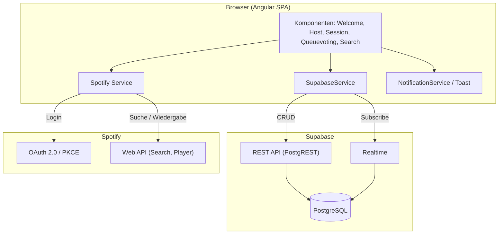
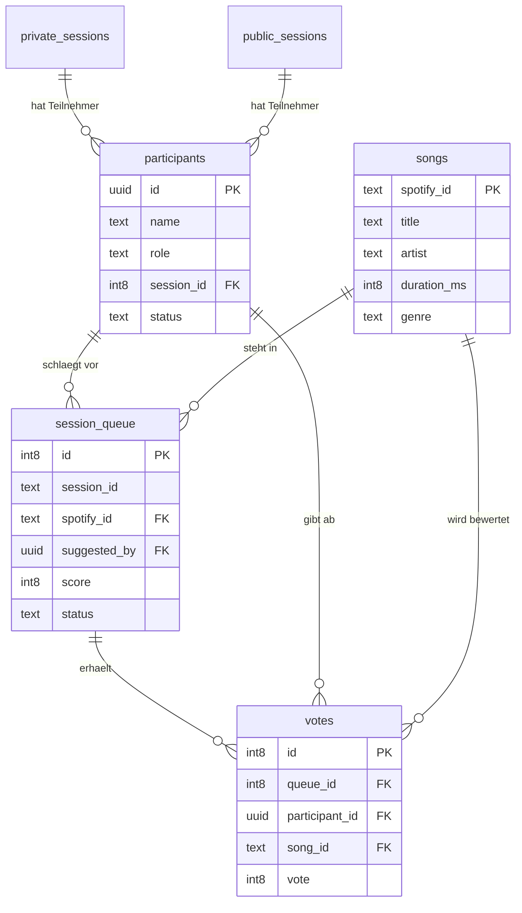

# Pflichtenheft

Projekt: UpNext - Musik Voting
Projektteam: Christian Hahnl, Andreas Klehr
Stand: 05.05.2026


## Inhalt

1. Ausgangslage
2. Ist-Zustand
3. Zielsetzung
4. Anforderungen
5. UI-Konzept
6. Lieferobjekte
7. Technische Dokumentation (Architektur, Datenkatalog, ERD, API, Setup, Testkonzept)


## 1. Ausgangslage

Auf Partys und Events entscheidet meist eine einzelne Person (Host oder DJ) über die Musik. Die
Gäste haben kaum geordnete Möglichkeiten, ihre Wünsche einzubringen. Das führt zu Unzufriedenheit,
zum Bedrängen des DJs und zu einer Musikauswahl, die nicht die Stimmung trifft. Es fehlt ein
einfaches, digitales Werkzeug, mit dem alle Gäste mitbestimmen können, und zwar ohne technische
Hürden wie eine App-Installation.


## 2. Ist-Zustand

| Bestehende Lösung | Schwäche |
|-------------------|----------|
| Zuruf an den DJ | chaotisch, unfair, unterbricht den DJ, skaliert nicht |
| Klassische Spotify-Playlist | nur eine Person verwaltet sie, keine Mitbestimmung |
| Spotify Jam / Gruppen-Sessions | keine Abstimmung, keine Verdrängung schlechter Songs |
| Wunschzettel auf Papier | analog, nicht in Echtzeit, kein Ranking |

Es gibt also kein System, das Songvorschläge mit einer Abstimmung kombiniert und gleichzeitig ohne
App-Installation für viele Gäste nutzbar ist.


## 3. Zielsetzung

Geplant ist eine responsive Webanwendung mit zwei Modi:

- Modus 1 (Home Party, bis 30 Gäste): Die Gäste schlagen Songs vor und stimmen ab. Die
  Warteschlange sortiert sich nach dem Score und spielt automatisch über das Spotify-Gerät des Hosts.
- Modus 2 (Großevents/Clubs, bis 3.000 Gäste): Die Gäste schlagen Songs vor und bewerten sie. Der
  DJ sieht die Wünsche, behält aber die volle Kontrolle über die Wiedergabe.

Messbare Ziele:

- Beitritt zu einer Session über einen vom Host generierten QR-Code
- Keine App-Installation notwendig
- Songvorschläge werden in unter 3 Sekunden verarbeitet
- Abstimmungsergebnisse werden korrekt und in Echtzeit aktualisiert
- In Modus 2 sind bis zu 3.000 gleichzeitige Nutzer je Session vorgesehen
- Fehlerfreier Betrieb während eines Testevents in Modus 1

Nicht-Ziele:

- Keine eigene Musikplattform und kein eigener Streaming-Dienst
- Keine native Mobile-App
- Kein Benutzerkonto-System mit Passwörtern, die Identifikation läuft über Session und Name
- Kein Bezahlsystem, Spotify-Premium wird vorausgesetzt


## 4. Anforderungen

### 4.1 Funktionale Anforderungen

Priorität: M = Muss, S = Soll, K = Kann

| ID | Anforderung | Beschreibung | Prio | Modus |
|------|-------------|--------------|------|-------|
| FA01 | Spotify-Login | Host meldet sich per OAuth 2.0 (PKCE) mit Spotify-Premium an | M | 1 |
| FA02 | Session erstellen | Host legt Session mit Titel an, System erzeugt Session-ID und QR-Code | M | 1 |
| FA03 | Session beitreten | Gast tritt per QR-Code/ID bei und vergibt einen Namen | M | 1+2 |
| FA04 | Songsuche | Gast sucht Songs über die Spotify-Datenbank | M | 1+2 |
| FA05 | Song hinzufügen | Gast fügt einen Song zur Warteschlange hinzu | M | 1+2 |
| FA06 | Voting | Teilnehmer geben Up- und Downvotes ab, eine Stimme pro Person und Song | M | 1+2 |
| FA07 | Queue-Ranking | Warteschlange wird absteigend nach Score sortiert (Top 10) | M | 1 |
| FA08 | Gespielte Songs entfernen | Der laufende Song wird automatisch aus der Queue entfernt | M | 1 |
| FA09 | Auto-Wiedergabe | Songs laufen automatisch auf dem gewählten Spotify-Gerät des Hosts | M | 1 |
| FA10 | Teilnehmerverwaltung | Host kann Teilnehmer sperren und entsperren | S | 1 |
| FA11 | Session beenden | Host beendet die Session, alle Teilnehmer werden entfernt | M | 1 |
| FA12 | Echtzeit-Sync | Queue, Votes und Lobby werden live für alle synchronisiert | M | 1 |
| FA13 | Downvote-Verdrängung | Stark negativ bewertete Songs werden verdrängt | K | 1 |
| FA14 | Ideenliste DJ | DJ sieht bewertete Vorschläge ohne automatische Wiedergabe | K | 2 |
| FA15 | Nutzer-/Genre-Analyse | Auswertung von Abstimmungsverhalten, Badges, beliebte Genres | K | 1+2 |
| FA16 | Fehlerbenachrichtigung | Verständliche Fehlermeldungen über eine Toast-Komponente | M | 1+2 |

### 4.2 Nicht-funktionale Anforderungen

| ID | Anforderung | Kriterium |
|------|-------------|-----------|
| NF01 | Responsiv | Bedienbar auf dem Smartphone ohne horizontales Scrollen |
| NF02 | Performance | Songvorschlag in unter 3 Sekunden verarbeitet |
| NF03 | Skalierbarkeit | Architektur für bis zu 3.000 gleichzeitige Nutzer je Session (Modus 2) |
| NF04 | Keine Installation | Lauffähig im modernen Browser ohne Plugin |
| NF05 | Zugriffsschutz | Host-Funktionen sind abgesichert (kein Broken Access Control) |
| NF06 | Stabilität | Fehlerfreier Betrieb während eines Testevents |
| NF07 | Wartbarkeit | Komponentenbasierte Architektur mit getrennter Service-Schicht |


## 5. UI-Konzept

Die Anwendung ist für das Smartphone ausgelegt (Mobile-first). Wichtige Seiten:

| Seite | Inhalt |
|-------|--------|
| Welcome | Eingabefeld für die Session-ID, Button zum Erstellen einer Session (Host) |
| Set-Name | Namenseingabe vor dem Beitritt |
| Host-Login | Anmeldung mit Spotify, danach Session-Titel und Session starten |
| Session-Host | QR-Code, Geräteauswahl, Teilnehmerliste mit Sperren-Funktion, aktueller Song und Queue, Session beenden |
| Session-Member | Lobby mit Host und Mitgliedern, Songsuche, Warteschlange mit Voting-Buttons |
| Error (404) | Fehlerseite bei ungültiger Session oder fehlender Berechtigung |

Ablauf für die Gäste: QR-Code scannen, Namen eingeben, in der Lobby Songs suchen, hinzufügen und
abstimmen. Das Design ist an die Spotify-Optik angelehnt (dunkler Hintergrund, grüne Akzentfarbe).


## 6. Lieferobjekte

| Lieferobjekt | Inhalt | Abnahmekriterium |
|--------------|--------|------------------|
| Webanwendung (Prototyp) | Lauffähige Angular-App, Modus 1 | FA01 bis FA09, FA11, FA12 bestanden |
| Datenbank (Supabase) | Schema, Tabellen, Realtime aktiv | Alle Tabellen vorhanden, Realtime auf session_queue aktiv |
| Projektdokumentation | Auftrag, Pflichtenheft, Arbeitspakete, Gantt, Testprotokoll | Alle Kapitel vollständig |
| README | Start- und Installationsanleitung | App startet auf fremdem Rechner laut Anleitung |
| Präsentation | Pitch inkl. Live-Demo | Demo läuft live in Modus 1 |


## 7. Technische Dokumentation

### 7.1 Architektur

UpNext ist eine Single-Page-Application auf Basis von Angular. Es gibt kein eigenes Backend. Die
Speicherung und die Echtzeit-Kommunikation übernimmt Supabase (PostgreSQL mit Realtime und einer
automatisch erzeugten REST-API). Die Musikdaten und die Wiedergabe kommen über die Spotify Web API.



Technologie-Stack:

| Schicht | Technologie |
|---------|-------------|
| Frontend | Angular 21 (Standalone Components, Signals), TypeScript, SCSS |
| Datenbank / Backend | Supabase (PostgreSQL, Realtime, PostgREST) |
| Musik / Auth | Spotify Web API (@spotify/web-api-ts-sdk), OAuth 2.0 mit PKCE |
| QR-Codes | angularx-qrcode |
| Tests | Vitest |

Wichtige Entscheidungen:

- Queue-Änderungen werden über Supabase-Realtime an alle Clients gepusht, kein Polling der DB.
- Spotify bietet keine Webhooks für den Wiedergabestatus. Deshalb pollt der Host-Client den
  laufenden Song alle 4 Sekunden und entfernt gespielte Songs.
- Der Host teilt sein Spotify-Token über die Session, damit Mitglieder ohne eigenen Spotify-Account
  suchen können.
- Die erste Ziffer der Session-ID kodiert den Modus: 1xxxxx ist Modus 1 (privat), 2xxxxx ist Modus 2.

### 7.2 Datenkatalog

Datenbank: PostgreSQL (Supabase), Schema public.

private_sessions (Modus-1-Sessions)

| Spalte | Typ | Beschreibung |
|--------|-----|--------------|
| session_id | int8 (PK) | Eindeutige Session-ID (1xxxxx) |
| title | text | Anzeigename der Session |
| qrCodeData | text | Beitritts-URL für den QR-Code |
| status | text | running / finished |
| spotify_token | text | Geteiltes Spotify-Token (JSON) |
| active_device_id | text | Aktives Spotify-Wiedergabegerät |
| duration_ms | int8 | optionale Dauer-Information |
| created_at | timestamptz | Erstellungszeitpunkt |

public_sessions (Modus-2-Sessions)

| Spalte | Typ | Beschreibung |
|--------|-----|--------------|
| session_id | int8 (PK) | Eindeutige Session-ID (2xxxxx) |
| event_name | text | Name des Events |
| organicer | text | Veranstalter (DJ) |
| qrCodeData | text | Beitritts-URL für den QR-Code |
| status | text | Status der Session |
| created_at | timestamptz | Erstellungszeitpunkt |

participants (Teilnehmer einer Session)

| Spalte | Typ | Beschreibung |
|--------|-----|--------------|
| id | uuid (PK) | Eindeutige Teilnehmer-ID |
| name | text | Anzeigename |
| role | text | host / member |
| session_id | int8 (FK) | Zugehörige Session |
| status | text | active / blocked |
| joined_at | timestamptz | Beitrittszeitpunkt |

songs (globaler Song-Katalog)

| Spalte | Typ | Beschreibung |
|--------|-----|--------------|
| spotify_id | text (PK) | Spotify-Track-URI |
| title | text | Songtitel |
| artist | text | Künstler |
| album_image | text | Cover-URL |
| duration_ms | int8 | Songlänge in Millisekunden |
| genre | text | Genre (für Analyse) |
| sessionId | int8 | Session, in der der Song zuerst auftauchte |

session_queue (Warteschlange je Session)

| Spalte | Typ | Beschreibung |
|--------|-----|--------------|
| id | int8 (PK) | Eindeutiger Queue-Eintrag |
| session_id | text | Session-Referenz |
| spotify_id | text (FK -> songs) | Referenzierter Song |
| suggested_by | uuid (FK -> participants) | Vorschlagender Teilnehmer |
| score | int8 | Summe der Votes |
| status | text | queued / gespielt |

votes (abgegebene Stimmen)

| Spalte | Typ | Beschreibung |
|--------|-----|--------------|
| id | int8 (PK) | Eindeutige Stimme |
| queue_id | int8 (FK -> session_queue) | Bewerteter Queue-Eintrag |
| participant_id | uuid (FK -> participants) | Wählender Teilnehmer |
| song_id | text (FK -> songs) | Bewerteter Song |
| vote | int8 | +1 (Upvote) oder -1 (Downvote) |

### 7.3 ERD



### 7.4 API-Dokumentation

Es gibt kein eigenes Backend. Die interne Schnittstelle ist die Service-Schicht (SupabaseService)
über der von Supabase automatisch erzeugten REST-API (PostgREST). Dazu kommt die externe Spotify
Web API.

Datenzugriff über SupabaseService:

| Methode | Tabelle / Aktion | Request | Response |
|---------|------------------|---------|----------|
| addPrivateSession(title) | INSERT private_sessions | title, session_id, qrCodeData, status=running | erzeugte Session |
| joinPrivateSession(id) | SELECT private_sessions | session_id | Session oder null |
| getPrivateSessionInfos(id) | SELECT private_sessions | session_id | vollständige Session |
| addUser(name, sessionId, host) | INSERT participants | name, role, session_id | { id } |
| getAllParticipantsBySessionId(id) | SELECT participants | session_id | Teilnehmerliste |
| checkHost(userId, sessionId) | SELECT participants | id, session_id, role=host | Treffer oder null |
| setParticipantStatus(id, status) | UPDATE participants | status (active/blocked) | - |
| endSession(sessionId) | UPDATE private_sessions | status=finished | - |
| addSongToQueue(sessionId, song, userId) | UPSERT songs + INSERT session_queue | Song-Daten, suggested_by, score=1 | Queue-Eintrag |
| getQueue(sessionId) | SELECT session_queue + songs | session_id, status=queued, Top 10 | Queue mit Song-Daten |
| removeSongFromQueue(queueId) | DELETE votes + DELETE session_queue | queue_id | - |
| vote(queueId, participantId, value) | UPSERT votes + Score-Update | queue_id, participant_id, vote=+/-1 | aktualisierter Eintrag |
| subscribeToQueue(sessionId, cb) | Realtime postgres_changes | Abo auf session_queue | Push bei Änderung |

Genutzte Spotify-Endpunkte:

| Zweck | Methode / Endpunkt |
|-------|--------------------|
| Login | GET /authorize (OAuth 2.0 PKCE) |
| Profil | GET /v1/me |
| Songsuche | GET /v1/search?type=track&market=AT |
| Verfügbare Geräte | GET /v1/me/player/devices |
| Wiedergabe übertragen | PUT /v1/me/player |
| Aktuell gespielt | GET /v1/me/player/currently-playing |
| Zur Spotify-Queue hinzufügen | POST /v1/me/player/queue |

Zum Zugriffsschutz (NF05): Host-Aktionen prüfen über checkHost(), ob die im Browser gespeicherte
userId in der Session die Rolle host hat. Andernfalls wird auf die 404-Seite umgeleitet.

### 7.5 Setup

Benötigt: Node.js (Version 20 oder neuer), npm, ein moderner Browser und ein Spotify-Premium-Account.
Die ausführliche Anleitung steht in [07_readme-anwendung.md](07_readme-anwendung.md).

```
npm install
npm start
```

Danach im Browser http://localhost:4200 öffnen.

| Konfiguration | Ort |
|---------------|-----|
| Supabase-URL und anon-Key | src/environments/environment.ts |
| Spotify-Client-ID | src/services/spotify.ts |
| Redirect-URI | <origin>/callback (im Spotify-Dashboard hinterlegen) |

### 7.6 Testkonzept

Für jede Muss-Anforderung gibt es mindestens einen Testfall. Die Ergebnisse stehen im
[Testprotokoll](06_testprotokoll.md). Zusätzlich laufen automatisierte Tests mit Vitest (npm test).

| TC | Anforderung | Vorgehen | Erwartetes Ergebnis |
|----|-------------|----------|---------------------|
| TC01 | FA01 | Host meldet sich mit Spotify an | Login erfolgreich, Profil geladen |
| TC02 | FA02 | Session mit Titel erstellen | Session-ID und QR-Code werden erzeugt |
| TC03 | FA03 | Beitritt per QR/ID und Name | Gast landet in der richtigen Session |
| TC04 | FA04 | Song suchen | Trefferliste in unter 3 Sekunden |
| TC05 | FA05 | Song hinzufügen | Song erscheint in der Queue mit Score 1 |
| TC06 | FA06 | Up- und Downvote | Score ändert sich, eine Stimme pro Person |
| TC07 | FA07 | Mehrere Votes | Queue absteigend nach Score sortiert |
| TC08 | FA08 | Song wird abgespielt | Song verschwindet aus der Queue |
| TC09 | FA09 | Gerät wählen, Top-Song | Song wird automatisch abgespielt |
| TC10 | FA11 | Session beenden | Mitglieder werden hinausgeworfen |
| TC11 | FA12 | Zwei Geräte | Änderung erscheint live auf dem zweiten Gerät |
| TC12 | FA10 | Teilnehmer sperren | Teilnehmer wird in Echtzeit blockiert |
| TC13 | NF05 | Nicht-Host ruft Host-URL auf | Weiterleitung auf 404 |
| TC14 | FA16 | Fehler provozieren | Verständliche Fehlermeldung |
