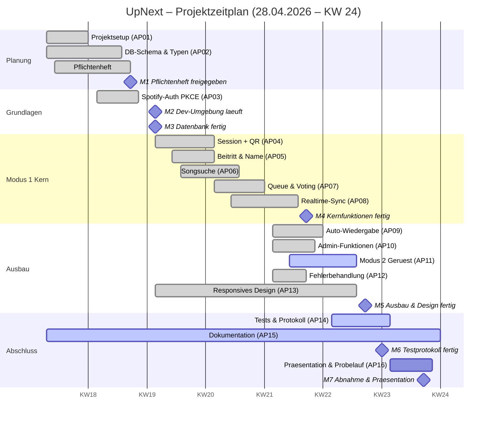

# 🎵 UpNext — Musik Voting
### Schritt 5 · Zeitplanung (Gantt-Diagramm)

|  |  |
|---|---|
| **Projekt** | UpNext – Musik Voting |
| **Dokument** | Gantt-Diagramm & Meilensteine |
| **Version** | 1.0 |
| **Datum** | 06.05.2026 |
| **Autoren** | Christian Hahnl · Andreas Klehr |
| **Status** | Freigegeben |

---

## 1. Meilensteine

Meilensteine sind überprüfbare **Zwischenergebnisse** (abgeschlossene Zustände), keine Tätigkeiten.

| Meilenstein | Ergebnis | KW |
|:-----------:|----------|:----:|
| **M1** | Pflichtenheft vom Betreuer freigegeben | KW 19 |
| **M2** | Entwicklungsumgebung läuft (Angular + Supabase + Spotify-PoC erfolgreich) | KW 20 |
| **M3** | Datenbank vollständig, Schema & Realtime einsatzbereit | KW 20 |
| **M4** | Modus-1-Kernfunktionen umgesetzt (Session, Beitritt, Suche, Queue, Voting, Sync) | KW 22 |
| **M5** | Auto-Wiedergabe, Admin-Funktionen & Design fertig | KW 23 |
| **M6** | Testprotokoll vollständig ausgefüllt | KW 23 |
| **M7** | Abschlusspräsentation gehalten, Projekt abgenommen | KW 24 |

## 2. Zeitachse (Kalenderwochen 2026)

| KW | Zeitraum | Schwerpunkt |
|:--:|----------|-------------|
| KW 18 | 27.04 – 03.05 | Projektstart, Setup, Schema |
| KW 19 | 04.05 – 10.05 | Pflichtenheft, Auth |
| KW 20 | 11.05 – 17.05 | Session, Beitritt, Suche |
| KW 21 | 18.05 – 24.05 | Queue, Voting, Realtime |
| KW 22 | 25.05 – 31.05 | Wiedergabe, Admin, Modus 2 |
| KW 23 | 01.06 – 07.06 | Design, Tests, Bugfixing |
| KW 24 | 08.06 – 14.06 | Abnahme & Präsentation |

## 3. Gantt-Diagramm

## 4. Hinweise zur Planung

- **Parallelarbeit:** Im 2er-Team laufen Frontend-Logik (CH) und Datenbank/Realtime (AK)
  weitgehend gleichzeitig. Das ist im Gantt an überlappenden Balken erkennbar.
- **Puffer:** KW 23 ist bewusst für Tests und Bugfixing reserviert – erfahrungsgemäß dauert das länger.
- **Querschnittsaufgaben:** Design (AP13) und Dokumentation (AP15) laufen projektbegleitend
  über mehrere Wochen statt als einmaliger Block.
- **Meilensteine als Zustände:** Eingetragen ist z. B. „Pflichtenheft **freigegeben**" (M1),
  nicht „Pflichtenheft schreiben".

---

*UpNext — Musik Voting · Gantt-Diagramm · Version 1.0 · 06.05.2026*

