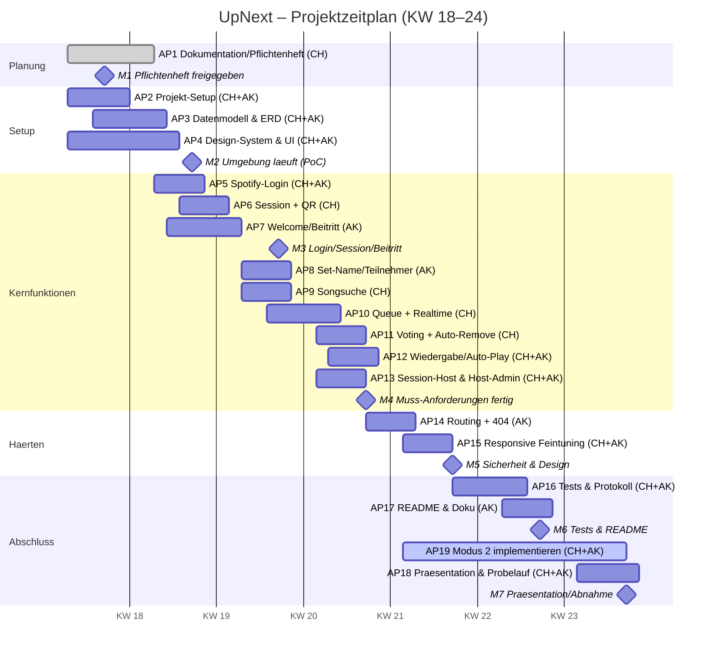

  
  

    
upNext

    
Gemeinsam Musik hören

  

  Dokument 05
  Gantt-Diagramm
  Zeitplanung

# Zeitplanung (Gantt-Diagramm)

Der Zeitplan zeigt die Arbeitspakete aus [Dokument 04](04_arbeitspakete.md) als Balken
über die Kalenderwochen **KW 18 bis KW 24** (28.04.2026 – Ende KW 24). Supabase,
Spotify-Integration, Design-System und die Session-Host-Ansicht entstehen **gemeinsam**
(CH + AK); zusätzlich übernimmt jeder eigene Features parallel (CH: Suche/Queue/Voting,
AK: Einstiegs-/Navigationsfluss). Für Tests und Bugfixing ist Puffer eingeplant.

## Meilensteine

| Meilenstein | Ergebnis (überprüfbarer Zustand) | KW |
|-------------|----------------------------------|----|
| **M1** | Pflichtenheft vom Betreuer freigegeben | KW 18 |
| **M2** | Entwicklungsumgebung läuft, DB & Deployment stehen (PoC) | KW 19 |
| **M3** | Login, Session & Beitritt funktionieren | KW 20 |
| **M4** | Alle Muss-Anforderungen (Modus 1) im Frontend implementiert | KW 21 |
| **M5** | Access Control & responsives Design abgeschlossen | KW 22 |
| **M6** | Testprotokoll vollständig ausgefüllt, README getestet | KW 23 |
| **M7** | Abschlusspräsentation gehalten, Projekt abgenommen | KW 24 |

## Gantt (Mermaid)

## Tipps zur Umsetzung (berücksichtigt)

- **Gemeinsam & parallel:** Supabase, Spotify und Design-System bauen beide zusammen;
  zusätzlich laufen CH-Features (Suche/Queue/Voting) und AK-Features (Einstiegsfluss)
  ab KW 18 parallel. Die Session-Host-Ansicht (AP13) entsteht gemeinsam.
- **Puffer:** Für Tests/Bugfixing sind eigene Pakete (AP16) und KW 22–23 reserviert.
- Meilensteine sind als **abgeschlossene Zustände** formuliert (z. B. „Pflichtenheft
  *freigegeben*"), nicht als Tätigkeit.
