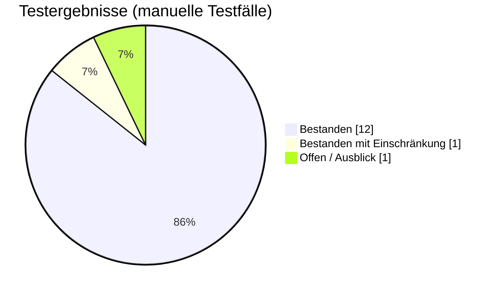

<div align="center">

# 🎵 UpNext — Musik Voting
### Schritt 6 · Testprotokoll

</div>

|  |  |
|---|---|
| **Projekt** | UpNext – Musik Voting |
| **Dokument** | Testprotokoll |
| **Version** | 1.0 |
| **Datum** | 07.06.2026 |
| **Getestet von** | Christian Hahnl · Andreas Klehr |
| **Status** | Abgeschlossen (Meilenstein M6) |

---

## 1. Testumgebung

| | |
|---|---|
| **Browser** | Chrome / Edge (aktuelle Version) |
| **Geräte** | Desktop + 2× Smartphone (für Realtime-Tests) |
| **Datenbank** | Supabase (PostgreSQL + Realtime) |
| **Spotify** | Premium-Account mit aktivem Wiedergabegerät |
| **Build** | Angular-Dev-Server (`npm start`) |
| **Automatisierte Tests** | Vitest (`npm test`) |

## 2. Testfortschritt



| Status | Anzahl |
|--------|:------:|
| ✅ Bestanden | 12 |
| ⚠️ Bestanden mit Einschränkung | 1 |
| 🔜 Offen (Ausblick) | 1 |
| ❌ Fehlgeschlagen | 0 |

## 3. Manuelle Testfälle

| TC | Anforderung | Beschreibung | Erwartet | Ergebnis | Datum |
|----|-------------|--------------|----------|:--------:|-------|
| TC01 | FA01 | Host meldet sich mit Spotify an | Login ok, Profil geladen | ✅ | 02.06.2026 |
| TC02 | FA02 | Session mit Titel erstellen | Session-ID + QR-Code, Weiterleitung | ✅ | 02.06.2026 |
| TC03 | FA03 | Beitritt per Session-ID + Name | Gast in korrekter Lobby | ✅ | 03.06.2026 |
| TC04 | FA04 | Songsuche „Bohemian Rhapsody" | Treffer in < 3 s | ✅ | 03.06.2026 |
| TC05 | FA05 | Song zur Queue hinzufügen | Song erscheint mit Score 1 | ✅ | 03.06.2026 |
| TC06 | FA06 | Up-/Downvote abgeben | Score ändert sich, 1 Stimme/Person | ✅ | 04.06.2026 |
| TC07 | FA07 | Queue nach Score sortieren | Höchster Score oben (Top 10) | ✅ | 04.06.2026 |
| TC08 | FA08 | Gespielten Song entfernen | Laufender Song verlässt die Queue | ✅ | 04.06.2026 |
| TC09 | FA09 | Auto-Wiedergabe auf gewähltem Gerät | Top-Song wird abgespielt | ✅ | 05.06.2026 |
| TC10 | FA11 | Session beenden | Mitglieder werden hinausgeworfen | ✅ | 05.06.2026 |
| TC11 | FA12 | Realtime über 2 Geräte | Änderung erscheint live auf Gerät B | ✅ | 05.06.2026 |
| TC12 | FA10 | Teilnehmer sperren | Gesperrter Gast verliert sofort Zugriff | ✅ | 05.06.2026 |
| TC13 | NF05 | Nicht-Host ruft Host-URL auf | Weiterleitung auf 404 | ✅ | 06.06.2026 |
| TC14 | FA16 | Fehler (kein aktives Gerät) | Verständliche Toast-Meldung | ✅ | 06.06.2026 |
| TC15 | FA13 | Downvote-Verdrängung an Schwellwert | Song wird automatisch entfernt | ⚠️ | 06.06.2026 |
| TC16 | FA14 | Modus 2 Ideenliste / Analyse | DJ sieht bewertete Vorschläge | 🔜 | – |

## 4. Automatisierte Tests (Vitest)

Zu allen Hauptkomponenten und Services existieren Spec-Dateien
(`*.spec.ts`), u. a. `app`, `host`, `queuevoting`, `search`, `session-host`, `session-member`,
`set-name`, `welcome`, `notification.service`, `toast`, `error`.

```bash
npm test
```

> Die Komponenten-Tests prüfen das korrekte Erzeugen der Komponenten sowie zentrale
> Service-Logik (Benachrichtigungen, Voting). Ausführung über die Vitest-Runner-Konfiguration.

## 5. Bekannte Einschränkungen & Bugs

| ID | Beschreibung | Bewertung | Umgang |
|----|--------------|-----------|--------|
| TC15 / FA13 | Songs werden **nicht** automatisch bei Erreichen einer Downvote-Grenze entfernt. Aktuell sinken negativ bewertete Songs nur im Ranking ab; der Host kann sie manuell entfernen. | Geringe Priorität (Kann-Anforderung) | Als **bekannte Einschränkung** dokumentiert; Auto-Verdrängung als Folgefeature geplant. |
| TC16 / FA14 | Modus 2 (Ideenliste für DJ) und die Nutzer-/Genre-Analyse mit Badges sind konzipiert, aber noch nicht funktional umgesetzt. | Ausblick / Kann-Anforderung | Konzept im [Pflichtenheft](03_pflichtenheft.md) festgehalten; Umsetzung in Folgeiteration. |
| Spotify 204 | Beim Hinzufügen zur Spotify-Queue liefert Spotify gelegentlich `204 No Content`, was der SDK-Deserializer als Fehler interpretiert. | Kosmetisch | Im `Spotify`-Service abgefangen und als Erfolg behandelt. |

## 6. Fazit

Alle **Muss-Anforderungen** für Modus 1 sind umgesetzt und bestanden. Eine Kann-Anforderung
(automatische Downvote-Verdrängung) ist als bekannte Einschränkung dokumentiert, Modus 2 und die
Analyse-Features sind als Ausblick gekennzeichnet. **Der Prototyp gilt damit als abnahmebereit.**

---

<div align="center">

*UpNext — Musik Voting · Testprotokoll · Version 1.0 · 07.06.2026*

</div>
