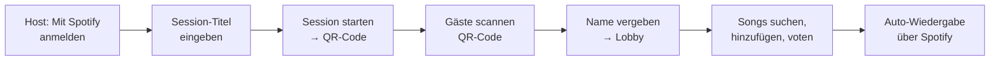

<div align="center">

# 🎵 UpNext — Musik Voting
### Schritt 7 · README (Anwendung starten)

</div>

|  |  |
|---|---|
| **Projekt** | UpNext – Musik Voting |
| **Dokument** | Installations- & Start-Anleitung |
| **Version** | 1.0 |
| **Datum** | 08.06.2026 |
| **Autoren** | Christian Hahnl · Andreas Klehr |

---

> Diese Anleitung erklärt jemandem, der den Code noch nie gesehen hat, wie die App lokal
> gestartet wird. Sie wurde auf einem zweiten Rechner getestet.

## 1. Was ist UpNext?

UpNext ist eine **Web-App für demokratisches Musik-Voting auf Partys**. Der Host startet eine
Session und meldet sich mit Spotify an. Gäste treten per **QR-Code** ohne App-Installation bei,
schlagen Songs vor und stimmen darüber ab. Die Warteschlange ordnet sich live nach den Stimmen
und spielt automatisch über das Spotify-Gerät des Hosts.

## 2. Voraussetzungen

| Voraussetzung | Hinweis |
|---------------|---------|
| **Node.js** ≥ 20 | inkl. npm — [nodejs.org](https://nodejs.org) |
| **Moderner Browser** | Chrome, Edge oder Firefox (aktuell) |
| **Spotify-Premium-Account** | nötig für Login & automatische Wiedergabe |
| **Aktives Spotify-Gerät** | z. B. Spotify-Desktop-App oder Handy beim Host geöffnet |

## 3. Installation

```bash
# 1. Repository klonen
git clone <repository-url>
cd UpNextGit

# 2. Abhängigkeiten installieren
npm install
```

## 4. Starten

```bash
# Entwicklungsserver starten
npm start
```

Anschließend im Browser öffnen:

```
http://localhost:4200
```

> **Hinweis zum Start-Skript:** In `package.json` ist `npm start` auf
> `ng serve --host 172.21.57.14` gesetzt (für Tests im lokalen Netz, damit Handys per QR-Code
> beitreten können). Für reine localhost-Nutzung kann stattdessen `npx ng serve` verwendet werden.
> Damit Handys im selben WLAN beitreten können, muss die Host-IP erreichbar sein.

## 5. Erste Schritte (Modus 1 – Home Party)



1. **Als Host:** Auf der Startseite „Session erstellen", mit **Spotify anmelden**, Session-Titel
   eingeben und Session starten.
2. Den angezeigten **QR-Code** den Gästen zeigen. In der Host-Ansicht das gewünschte
   **Spotify-Wiedergabegerät** auswählen.
3. **Als Gast:** QR-Code scannen (oder Session-ID auf der Startseite eingeben), **Namen** vergeben.
4. In der Lobby **Songs suchen**, zur Warteschlange **hinzufügen** und **up-/downvoten**.
5. Der höchstbewertete Song wird automatisch über das Spotify-Gerät des Hosts abgespielt.
6. Der Host kann Teilnehmer **sperren** oder die **Session beenden** (alle Gäste werden entfernt).

## 6. Konfiguration

| Was | Datei |
|-----|-------|
| Supabase-URL & anon-Key | `src/environments/environment.ts` |
| Spotify-Client-ID | `src/services/spotify.ts` |
| Spotify-Redirect-URI | muss im Spotify-Developer-Dashboard als `<origin>/callback` eingetragen sein |

## 7. Nützliche Befehle

| Befehl | Wirkung |
|--------|---------|
| `npm start` | Entwicklungsserver starten |
| `npm run build` | Produktions-Build erzeugen (`dist/`) |
| `npm test` | Unit-/Component-Tests mit Vitest ausführen |
| `npm run watch` | Build im Watch-Modus (Entwicklung) |

## 8. Fehlerbehebung

| Problem | Lösung |
|---------|--------|
| „Kein aktives Spotify-Gerät gefunden" | Spotify auf einem Host-Gerät öffnen und in der Host-Ansicht auswählen |
| Login schlägt fehl | Redirect-URI im Spotify-Dashboard prüfen (`<origin>/callback`) |
| Build bricht ab nach Typ-Regenerierung | `database.types.ts` muss **UTF-8** sein (kein UTF-16 durch PowerShell `>`) |
| Handy kann nicht beitreten | Host-IP/Port im selben WLAN erreichbar machen, Firewall prüfen |

---

<div align="center">

*UpNext — Musik Voting · README · Version 1.0 · 08.06.2026*

</div>
