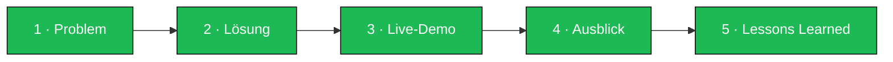

# 🎵 UpNext — Musik Voting
### Schritt 9 · Präsentation / Kunden-Pitch

|  |  |
|---|---|
| **Projekt** | UpNext – Musik Voting |
| **Dokument** | Präsentation / Pitch (Drehbuch) |
| **Dauer** | 10–15 Minuten |
| **Version** | 1.0 |
| **Datum** | 08.06.2026 |
| **Vortragende** | Christian Hahnl · Andreas Klehr |
| **Publikum** | Spotify Technology S.A. (Auftraggeber) |

---

## Aufbau im Überblick

| Abschnitt | Inhalt | Zeit | Wer |
|-----------|--------|:----:|:---:|
| 1 · Problem | Warum gibt es UpNext? | 2 min | AK |
| 2 · Lösung | Was wurde gebaut? | 2 min | CH |
| 3 · Live-Demo | Kernfunktionen live | 6 min | CH + AK |
| 4 · Ausblick | Was mit mehr Zeit? | 2 min | AK |
| 5 · Lessons Learned | Was haben wir gelernt? | 2 min | CH |

---

## 1. Problem (≈ 2 min)

- Auf Partys entscheidet **eine Person** über die Musik – der Rest hat keinen Einfluss.
- Gäste **bedrängen den DJ**, die Stimmung leidet, die Songauswahl trifft die Crowd oft nicht.
- Konkreter Auslöser: wiederkehrende Beschwerden über lokale DJs und schlechte Kommunikation
  zwischen Gästen und DJ.
- **Kernfrage:** *Wie wird die Musikauswahl fair, interaktiv und ohne Chaos?*

> **Pitch-Satz:** „Jeder kennt den Moment, in dem man dem DJ unbedingt einen Song zurufen will –
> UpNext macht aus diesem Zuruf eine Abstimmung."

## 2. Lösung (≈ 2 min)

- **UpNext** – eine Web-App, mit der **alle Gäste demokratisch** über die Playlist mitbestimmen.
- **Beitritt per QR-Code, keine App-Installation.**
- Gäste schlagen Songs vor und **voten** – die Warteschlange sortiert sich live, der Top-Song läuft
  **automatisch über Spotify**.
- Zwei Modi: **Home Party** (autonomer DJ) und **Großevent/Club** (Werkzeug für den DJ).
- Technik in einem Satz: **Angular** Frontend · **Supabase** (Echtzeit-Datenbank) · **Spotify Web API**.

## 3. Live-Demo (≈ 6 min) — Kernstück

> Vorher Probelauf machen! Spotify-Gerät offen, zweites Handy bereit, Internet getestet.

**Demo-Drehbuch (Modus 1):**

1. **Host startet Session** → mit Spotify anmelden, Titel „Demo-Party", QR-Code erscheint.
2. **Gerät wählen** → aktives Spotify-Gerät in der Host-Ansicht auswählen.
3. **Gast tritt bei** → QR-Code mit dem Handy scannen, Namen eingeben, Lobby erscheint.
4. **Song hinzufügen** → live einen Song suchen und zur Warteschlange hinzufügen.
5. **Voting live** → vom zweiten Gerät up-/downvoten; **Queue sortiert sich in Echtzeit** auf beiden Geräten.
6. **Auto-Wiedergabe** → Top-Song läuft automatisch über Spotify, danach **verschwindet er aus der Queue**.
7. **Admin** → Teilnehmer sperren, dann **Session beenden** → Gäste werden automatisch hinausgeworfen.

> **Backup-Plan:** Falls das WLAN streikt → Screenshots/aufgezeichnetes Demo-Video bereithalten.
> Es muss auch **live geändert** werden können (Spotify fordert Live-Anpassbarkeit).

## 4. Was würden wir mit mehr Zeit bauen? (≈ 2 min)

- **Modus 2 vollständig:** Ideenliste & Bewertung als reines DJ-Werkzeug für bis zu 3.000 Gäste.
- **Automatische Downvote-Verdrängung** ab einem Schwellwert.
- **Nutzer-Analyse & Badges:** aktive/kritische/wählerische Nutzer erkennen, Gamification.
- **Genre-Analyse:** Live-Übersicht, welche Genres/Artists gerade beliebt sind.
- **Skalierungstests** für die 3.000-Nutzer-Anforderung.

## 5. Lessons Learned (≈ 2 min)

- **Erst dokumentieren, dann coden:** Pflichtenheft & ERD haben spätere Umbauten erspart.
- **Externe APIs sind tückisch:** Spotify liefert keine Webhooks → Polling-Lösung nötig;
  `204 No Content` musste gesondert behandelt werden.
- **Realtime lohnt sich:** Supabase-Realtime macht die Voting-UX erst überzeugend.
- **Scope-Disziplin:** Modus 1 sauber fertigstellen war wichtiger, als Modus 2 halb zu bauen –
  klare Abgrenzung (Nicht-Ziele) hat geholfen.
- **Im 2er-Team parallel arbeiten:** Frontend-Logik und Datenbank/Realtime gleichzeitig.

---

## Checkliste vor dem Pitch

- [ ] Probelauf der gesamten Demo durchgeführt
- [ ] Spotify-Premium eingeloggt, Wiedergabegerät aktiv
- [ ] Zweites Gerät (Gast) bereit & im selben Netz
- [ ] Backup-Video / Screenshots griffbereit
- [ ] Rollen & Zeiten abgestimmt (wer sagt was)
- [ ] Live-Änderung vorbereitet (z. B. spontaner Song-Wunsch aus dem Publikum)

---

*UpNext — Musik Voting · Präsentation · Version 1.0 · 08.06.2026*

